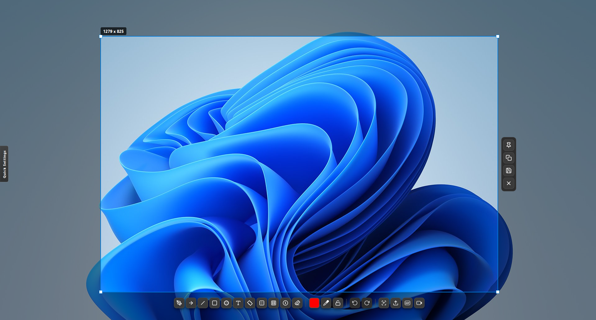
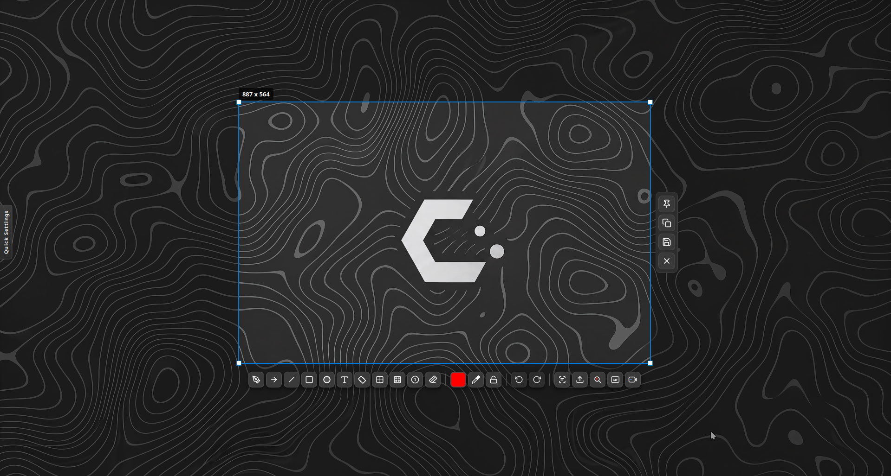

# EShot

Native screenshot, annotation, OCR, visual-search, upload, GIF, and video capture for Windows and Linux.

[](https://github.com/Benoks/EShot/releases/latest)
[](https://github.com/Benoks/EShot/actions/workflows/build.yml)
[](#platform-support)
[](https://www.qt.io/)
[](LICENSE)

> [!IMPORTANT]
> The Linux build is tested on KDE Plasma 6 with Wayland, primarily on CachyOS. GNOME Wayland support is experimental, still needs broader testing, and may be unstable or incomplete. Other desktop environments and compositors remain unsupported and are unlikely to work correctly.

EShot keeps the complete screenshot workflow in one compact tray application: select a region, annotate it, copy or save it, extract text, search the image, upload it, pin it above other windows, or record it as GIF/MP4.

## Screenshots

| Windows | Linux (CachyOS / KDE Plasma 6) |
| --- | --- |
|  |  |

## Platform support

| Platform | Status | Distribution |
| --- | --- | --- |
| Windows 10/11 x64 | Stable | Installer and portable ZIP |
| Windows 11 ARM64 | Stable | Native ARM64 installer and portable ZIP |
| Linux x86_64 (KDE Plasma 6 Wayland) | **Experimental, tested** | AppImage, `.deb`, AUR, and portable archive |
| Linux x86_64 (GNOME Wayland) | **Experimental, limited testing** | May be unstable; AppImage, `.deb`, AUR, and portable archive |
| Other Linux desktops | Unsupported | Unlikely to work correctly |

## Features

- Region and monitor capture with multi-monitor and high-DPI handling
- Compact selection overlay with configurable actions and shortcuts
- Pen, arrow, line, rectangle, ellipse, text, highlighter, blur, counter, eraser, and eyedropper tools
- Undo/redo, selection locking, color controls, and configurable toolbar visibility
- Tesseract OCR with selectable language packs
- Google Lens or Yandex Images visual search for the selected region
- Screenshot uploads to Catbox, Uguu, Litterbox, TmpFiles.org, temp.sh, Allwebs, Radikal Cloud, Google Drive, and Yandex Disk
- Always-on-top pinned captures
- Selected-region GIF recording
- MP4 recording with configurable FPS, quality, duration, desktop audio, and microphone audio
- Real microphone-device selection on Linux and Windows
- Global capture and direct screenshot/GIF/video hotkeys
- Configurable pause, stop, and cancel recording shortcuts
- Settings import/export and automatic release checks
- Self-update support for installed AppImages

## Capture workflow

Start a capture from the tray icon, `Print Screen`, a custom global shortcut, a direct-action shortcut, or the command line. Select a region and use the overlay toolbar to annotate, OCR, search, upload, pin, copy, save, or begin recording.

Double-clicking a screen during selection captures that complete monitor. The overlay adapts to tight spaces and scaled multi-monitor layouts.

## Install

Download the latest build from [GitHub Releases](https://github.com/Benoks/EShot/releases/latest).

### Windows

1. Download `EShot_Setup_v<version>_x64.exe` or the ARM64 installer.
2. Run the installer and choose the optional FFmpeg/OCR components you need.
3. Launch EShot from the Start menu or system tray.

Portable x64 and ARM64 ZIP archives are also attached to each release.

### Linux: KDE Plasma 6 and GNOME Wayland

KDE Plasma 6 Wayland is the primary tested Linux target. GNOME Wayland support is under active development and currently requires more real-world testing; capture, shortcuts, tray integration, or recording may behave differently between GNOME and portal versions.

1. Download `EShot-v<version>-x86_64.AppImage`.
2. Mark it executable if required:

   ```bash
   chmod +x EShot-v*-x86_64.AppImage
   ```

3. Open the AppImage.
4. Complete the graphical first-run wizard. It can install FFmpeg/GStreamer, PipeWire portal components, Tesseract, selected OCR languages, and application-menu integration through the system package manager.
5. Use **Use Print Screen for EShot** to assign `Print Screen`. KDE keeps Spectacle's other shortcuts. GNOME uses the Global Shortcuts portal when available and an EShot-only custom shortcut on older GNOME releases.

The AppImage bundles EShot and Qt. Optional media, OCR, and desktop-integration packages remain system packages. Skipped dependencies can be installed later from **Settings → Open Linux dependency setup**.

Integrated AppImages are stored for the current user under `~/.local/opt/EShot`. When an update is available, EShot downloads the matching AppImage release asset, verifies its GitHub SHA-256 digest, replaces the installed AppImage, and restarts it. Native package builds should be updated through their package manager.

### Arch Linux and CachyOS

Install the EShot-maintained AUR binary package with an AUR helper:

```bash
yay -S eshot-bin
```

The package installs the release AppImage and its desktop entry through pacman. Update it with your normal AUR helper rather than EShot's AppImage updater.

### Linux runtime notes

- Wayland screenshots and recordings use XDG Desktop Portal and PipeWire.
- KDE global shortcuts use KGlobalAccel. GNOME uses the Global Shortcuts portal where available and can install an EShot-only GNOME custom shortcut as a compatibility fallback.
- Stock GNOME does not expose legacy tray icons. EShot remains available through `Print Screen`, the application-menu Capture and Settings actions, and by launching EShot again to open Settings.
- GNOME and KDE Wayland use an XWayland selection overlay so text entry, focus, and one-canvas multi-monitor selection behave consistently.
- GIF recording uses GStreamer for portal capture and FFmpeg for final GIF encoding.
- MP4 recording requires a GStreamer AAC encoder when audio is enabled.
- Screen recording permission is handled by the desktop portal. EShot stores a separate restore token per monitor when the portal supports persistent sessions.
- A recorded region must fit inside one monitor. If the portal opens a monitor chooser, select the monitor containing the region.
- The optional dependency setup uses the PackageKit session installer when the desktop provides it, then falls back to the native pacman, apt or dnf workflow.

## Visual search

Choose **Google Lens** or **Yandex Images** in Settings. EShot uploads only the selected region to a temporary public image host and opens the chosen visual-search provider with that temporary URL.

Do not use visual search for private or sensitive screenshots.

## OCR

OCR is powered by Tesseract. The first-run wizard can install English, the system language, and additional language data. Missing languages remain visible but disabled so the missing dependency is clear.

## Upload services

Anonymous providers work without credentials. Google Drive and Yandex Disk require OAuth access tokens; Allwebs and Radikal Cloud require service API keys. Tokens are stored in EShot settings on the local machine.

### Google Drive token setup

1. Open [Google OAuth 2.0 Playground](https://developers.google.com/oauthplayground).
2. Select the Drive API v3 scope:

   ```text
   https://www.googleapis.com/auth/drive.file
   ```

3. Authorize the scope and exchange the authorization code for tokens.
4. Copy the `access_token`, or copy the complete JSON response.
5. Paste it into EShot's Google Drive token field.

OAuth Playground access tokens expire. Generate a new token if an upload later returns HTTP 401.

## Default shortcuts

Most shortcuts can be changed in Settings.

| Shortcut | Action |
| --- | --- |
| `Print Screen` | Start region capture |
| Double-click a screen | Capture the complete monitor |
| `Enter` / `Ctrl+C` | Copy selection |
| `Ctrl+S` | Save selection |
| `Esc` | Cancel or close |
| `P` | Pen |
| `A` | Arrow |
| `L` | Line |
| `R` | Rectangle |
| `C` | Circle |
| `T` | Text |
| `H` | Highlighter |
| `B` | Blur |
| `N` | Counter |
| `X` | Eraser |
| `D` | Semi-transparent rectangle |
| `I` | Eyedropper |
| `Ctrl+Z` / `Ctrl+Shift+Z` | Undo / redo |

## Command line

```powershell
# Windows
EShot.exe --capture
EShot.exe --save "C:\path\to\capture.png"
EShot.exe --silent
```

```bash
# Linux
EShot --capture
EShot --save "$HOME/Pictures/capture.png"
EShot --silent
EShot --quit

# Native packages also install the lowercase launcher:
eshot --capture
```

## Build from source

Core requirements:

- CMake 3.16+
- C++17 compiler
- Qt 6 Core, GUI, Widgets, Network, and DBus on Linux

### Linux

Ubuntu/Debian and CachyOS/Arch dependency helpers are included:

```bash
./scripts/linux/install-ubuntu-deps.sh
# or
./scripts/linux/install-cachyos-deps.sh

./scripts/linux/check-linux-runtime.sh
./scripts/linux/build-linux.sh
./dist-linux/bin/EShot
```

Build the AppImage:

```bash
./scripts/linux/build-appimage.sh
```

### Windows

```powershell
cmake -S . -B build -A x64
cmake --build build --config Release --parallel
```

Build the installer with Inno Setup 6:

```powershell
iscc EShot_Setup.iss
```

## Third-party components

EShot uses Qt, Tesseract OCR, FFmpeg, GStreamer, PipeWire, XDG Desktop Portal, and Inno Setup. See [THIRD_PARTY_NOTICES.md](THIRD_PARTY_NOTICES.md) for licensing details.

## License

EShot is released under the [MIT License](LICENSE).
