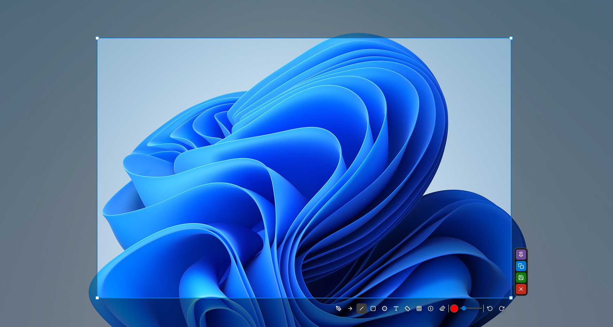

# EShot

Fast, lightweight Windows screenshot tool with annotations, OCR, uploads, pinned captures, GIF recording, and MP4 screen recording.

[](https://github.com/Benoks/EShot/releases/latest)
[](#)
[](https://www.qt.io/)
[](LICENSE)

<p align="center">
  
</p>

EShot is built for people who want a quick screenshot workflow without a heavy desktop app getting in the way. Capture an area, mark it up, copy it, save it, upload it, recognize text, search it with Google Lens, pin it as a reference, or record it as GIF/MP4 from one compact tray app.

## Highlights

- Region capture with multi-monitor and high-DPI support
- Full-screen monitor capture by double-clicking a screen during selection
- Clean annotation tools for fast markup
- OCR powered by Tesseract with selectable language packs
- Google Lens search for the selected area
- Direct uploads to short-term and long-term image/file hosts
- Pinned screenshots that stay above other windows
- GIF recording for selected screen areas
- MP4 video recording powered by FFmpeg
- Desktop audio and microphone support for video recording
- Customizable global, direct-capture, recording, and in-capture shortcuts
- Toolbar visibility settings
- Windows Print Screen conflict detection and fix helper
- Start with Windows through Task Scheduler
- GitHub release update check
- Import/export settings

## Capture Workflow

Start capture from the tray icon, global hotkey, command line, or direct action hotkeys. After selecting an area, EShot opens a compact toolbar where you can annotate, copy, save, upload, OCR, search with Google Lens, pin, or start GIF/video recording.

The selection UI adapts to tight screen space, keeps the dimension label anchored to the selected area, and supports locking the selection while editing.

## Annotation Tools

EShot includes the tools most screenshot workflows need:

- Freehand pen
- Arrow and line
- Rectangle and ellipse
- Semi-transparent rectangle
- Multiline text with font and size controls
- Highlighter
- Mosaic blur with adjustable intensity
- Counter/number markers
- Eraser
- Eyedropper color picker
- Undo and redo

## OCR

EShot can extract text from a selected area using Tesseract OCR. The installer can include the OCR engine and optional language packs.

Supported OCR language options include:

- English
- Turkish
- Russian
- German
- French
- Spanish
- Italian
- Portuguese
- Polish
- Dutch
- Japanese
- Korean
- Simplified Chinese

Missing language packs are shown disabled in the OCR dialog instead of silently disappearing.

## Uploads

Upload screenshots directly from the capture toolbar. EShot supports anonymous/simple hosts as well as OAuth-based storage providers.

Supported services:

- Catbox
- Uguu
- Litterbox
- Yandex Disk
- Google Drive

For OAuth providers, EShot accepts either a raw access token or the full redirect URL and extracts the token automatically. The upload dialog includes provider-specific help links for token setup.

## Google Lens

The Google Lens button opens a visual search for the selected area. It is useful for finding matching images, identifying UI elements, checking product images, or searching from a cropped screenshot without saving it first.

## GIF Recording

Record a selected screen area as a GIF. You can configure:

- FPS
- Maximum duration
- Loop behavior
- Start delay
- Output folder
- Direct GIF recording hotkey

## Video Recording

Record a selected area as an MP4 video. Video recording uses FFmpeg and supports:

- Configurable FPS
- Configurable CRF quality
- Optional duration limit
- Desktop/system audio
- Microphone audio
- Audio volume controls
- Microphone device selection
- Pause, stop, and cancel hotkeys
- Output folder

## Pin to Screen

Pinned screenshots stay above other windows. This is useful for reference images, snippets, UI comparison, notes, forms, and quick visual memory while working in another app.

## Settings

The settings window includes:

- General behavior
- Separate save folders for screenshots, GIFs, and videos
- Filename pattern preview
- Notification controls
- Capture behavior
- GIF and video recording settings
- Audio recording controls
- Appearance options
- High contrast mode
- Black tray icon option for light Windows themes
- Interface and toolbar visibility
- Global capture hotkey
- Direct screenshot/GIF/video hotkeys
- Recording control hotkeys
- In-capture tool/action shortcuts
- Settings export and import

## Default Shortcuts

Most shortcuts can be changed in Settings.

| Shortcut | Action |
| --- | --- |
| `Print Screen` | Start capture |
| Double-click screen | Capture that full monitor |
| `Enter` | Copy selected capture |
| `Ctrl+C` | Copy selected capture |
| `Ctrl+S` | Save selected capture |
| `Esc` | Cancel or close overlay |
| `Shift+Enter` | New line while editing text |
| `P` | Pen |
| `A` | Arrow |
| `L` | Line |
| `R` | Rectangle |
| `C` | Circle |
| `T` | Text |
| `H` | Highlighter |
| `B` | Blur |
| `N` | Counter |
| `X` | Eraser |
| `D` | Semi-transparent rectangle |
| `I` | Eyedropper |
| `Ctrl+Z` | Undo |
| `Ctrl+Shift+Z` | Redo |

## Install

1. Download the latest installer from the [Releases page](https://github.com/Benoks/EShot/releases/latest).
2. Run the setup file.
3. Select optional FFmpeg and OCR components if needed.
4. Start EShot from the Start menu, desktop shortcut, or tray icon.

If "Start with Windows" is enabled, EShot registers itself through Windows Task Scheduler.

## Command Line

```powershell
EShot.exe --capture
EShot.exe --save "C:\path\to\capture.png"
EShot.exe --silent
```

## Build From Source

Requirements:

- Windows 10 or Windows 11
- Qt 6
- CMake
- C++17 compatible compiler
- Inno Setup, only for installer builds

```powershell
mkdir build
cd build
cmake ..
cmake --build . --config Release
```

Installer:

```powershell
iscc EShot_Setup.iss
```

## Third-Party Components

EShot uses:

- Qt for the desktop UI
- Tesseract OCR for text recognition
- Tesseract tessdata language files for OCR language support
- FFmpeg for video recording
- Inno Setup for installer packaging

See [THIRD_PARTY_NOTICES.md](THIRD_PARTY_NOTICES.md) for details.

## License

EShot is released under the MIT License. See [LICENSE](LICENSE).
